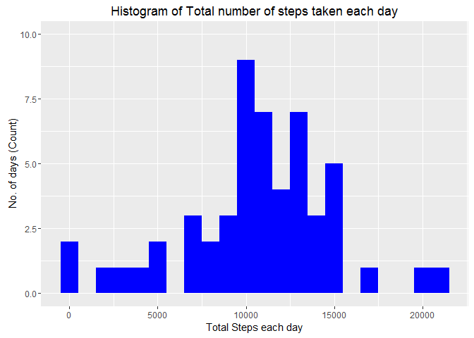
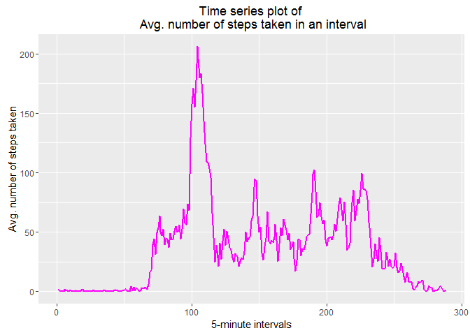
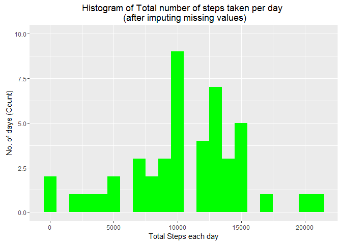
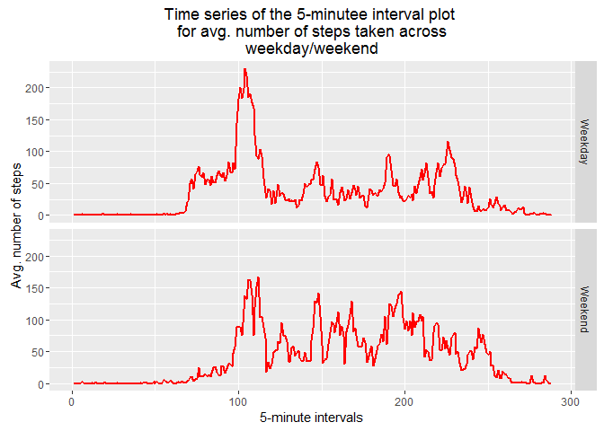

# Reproducible Research: Peer Assessment 1

## Introduction

It is now possible to collect a large amount of data about personal movement
using activity monitoring devices such as a Fitbit, Nike Fuelband, or Jawbone
Up. These type of devices are part of the "quantified self" movement - a group
of enthusiasts who take measurements about themselves regularly to improve
their health, to find patterns in their behavior, or because they are tech geeks.
But these data remain under-utilized both because the raw data are hard to
obtain and there is a lack of statistical methods and software for processing and
interpreting the data. 
This assignment makes use of data from a personal activity monitoring device.
This device collects data at 5 minute intervals through out the day. The data
consists of two months of data from an anonymous individual collected during
the months of October and November, 2012 and include the number of steps
taken in 5 minute intervals each day.  

##About the data
The data for this assignment can be downloaded from the course web site:  
- Dataset: [Activity monitoring data [52K]](https://d396qusza40orc.cloudfront.net/repdata%2Fdata%2Factivity.zip)  
The variables included in this dataset are:  
- steps: Number of steps taking in a 5-minute interval (missing values are
coded as NA)  
- date: The date on which the measurement was taken in YYYY-MM-DD
format  
- interval: Identifier for the 5-minute interval in which measurement was
taken  
The dataset is stored in a comma-separated-value (CSV) file and there are a
total of 17,568 observations in this dataset.  

## Load the required packages and set global options

```r
library(ggplot2)
```

```
## Warning: package 'ggplot2' was built under R version 3.2.3
```

```r
library(knitr)
```

```
## Warning: package 'knitr' was built under R version 3.2.4
```

```r
opts_chunk$set(echo = TRUE)
```

Set the working directory to where the data file is located

## Loading and preprocessing the data
### 1) Loading the data

```r
activity <- read.csv("activity.csv",header = TRUE)
```

### 2) Preprocessing the data

```r
str(activity) ##Check the structure of the data frame
```

```
## 'data.frame':	17568 obs. of  3 variables:
##  $ steps   : int  NA NA NA NA NA NA NA NA NA NA ...
##  $ date    : Factor w/ 61 levels "2012-10-01","2012-10-02",..: 1 1 1 1 1 1 1 1 1 1 ...
##  $ interval: int  0 5 10 15 20 25 30 35 40 45 ...
```

```r
activity$date <- as.Date(activity$date,"%Y-%m-%d")

activity$interval <- as.factor(activity$interval)
```

## What is mean total number of steps taken per day?

We ignore missing values here

### Create a table and Plot the total number of steps taken each day

```r
steps_each_day <- aggregate(steps ~ date,activity,sum)

ggplot(steps_each_day,aes(x=steps)) + geom_histogram(fill = "blue",binwidth = 1000) +        xlab("Total Steps each day") + ylab("No. of days (Count)") +
        ggtitle("Histogram of Total number of steps taken each day") + ylim(c(0,10))
```



### The mean and median total number of steps taken per day

```r
meansteps <- mean(steps_each_day$steps)
mediansteps <- median(steps_each_day$steps)
```

The **mean** is 1.0766189\times 10^{4} and **median** is 10765.

## What is the average daily activity pattern?
### Time Series plot of the 5-minute interval and the average number of steps taken, averaged across all days

```r
steps_interval <- aggregate(steps ~ interval,activity,mean,na.rm = TRUE)
ggplot(steps_interval,aes(as.integer(interval),steps)) + 
  geom_line(color = "magenta",size = 1) + 
    labs(title = "Time series plot of \n Avg. number of steps taken in an interval",
       x = "5-minute intervals",y = "Avg. number of steps taken")
```



### Which 5-minute interval, on average across all the days in the dataset, contains the maximum number of steps?

```r
max.steps <- steps_interval[which.max(steps_interval$steps),]
```

The maximum number of steps are taken at 835 interval with an average of 206.1698113 steps.

## Imputing missing values
### Total number of missing values in the dataset

```r
miss <- sum(is.na(activity))
```

There are 2304 missing values in the dataset 

### Fill the missing values by taking mean of that 5-minute interval across all days

```r
activity2 <- activity
        n <- nrow(activity2)
              for(i in 1:n){
                      if(is.na(activity2$steps[i])) {
                         activity2$steps[i] <- steps_interval[which(activity2$interval[i] == steps_interval$interval),]$steps
                         }
                    }
```

We check if all missing values have been replaced

```r
sum(is.na(activity2))
```

```
## [1] 0
```

```r
str(activity2)
```

```
## 'data.frame':	17568 obs. of  3 variables:
##  $ steps   : num  1.717 0.3396 0.1321 0.1509 0.0755 ...
##  $ date    : Date, format: "2012-10-01" "2012-10-01" ...
##  $ interval: Factor w/ 288 levels "0","5","10","15",..: 1 2 3 4 5 6 7 8 9 10 ...
```

### Create a histogram of the total number of steps taken each day after imputing missing values 

```r
new_steps_perday <- aggregate(steps ~ date,activity2,sum)

ggplot(new_steps_perday,aes(x=steps)) + geom_histogram(fill = "green",binwidth = 1000)          + xlab("Total Steps each day") + ylab("No. of days (Count)") +
          ggtitle("Histogram of Total number of steps taken per day \n (after imputing missing values)") + ylim(c(0,10))
```



### Report the mean and median total number of steps taken per day after imputing missing values.Do these values differ from the estimates from the first part of the assignment? What is the impact of imputing missing data on the estimates of the total daily number of steps?

```r
meansteps2 <- mean(new_steps_perday$steps)
mediansteps2 <- median(new_steps_perday$steps)
msteps <- meansteps2 - meansteps
medsteps <- mediansteps2 - mediansteps
```

The **mean** is 1.0766189\times 10^{4} and **median** is 1.0766189\times 10^{4} after the missing values were imputed. The difference between the means is 0 and medians is 1.1886792. Showing that the means remained constant while the new median is greater than the old one.

## Are there differences in activity patterns between weekdays and weekends?
### Create factor variable with two levels - "weekday" & "weekend"

```r
activity2$wkday_wkend <- is.factor(activity2$wkday_wkend)
for(j in 1:nrow(activity2)) {
  if(weekdays(activity2$date[j]) == "Saturday" | weekdays(activity2$date[j]) == "Sunday") {
    activity2$wkday_wkend[j] <- "Weekend"
  } else {activity2$wkday_wkend [j] <- "Weekday"}
}
```

### Make a a time series plot of the 5-minute interval and the average number of steps taken, averaged across all weekday days or weekend days

```r
Steps_perday_weekday <- aggregate(steps ~ interval + wkday_wkend,activity2,mean)

ggplot(Steps_perday_weekday,aes(as.integer(interval),steps)) + 
  geom_line(color = "red",size = 1) + facet_grid(wkday_wkend~.) + 
    labs(title = "Time series of the 5-minutee interval plot \n for avg. number of steps taken across \n weekday/weekend ", x = "5-minute intervals", y = "Avg. number of steps")
```


